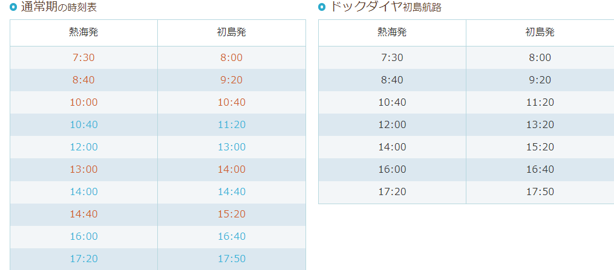

## 熱海旅行スケジュール
- [スケジュール](#スケジュール)
- [交通](#交通)
- [宿泊](#宿泊)
- [注意事項](#注意事項)
- [ご参考に](#ご参考に)
  - [初島定期船時刻表](#初島定期船時刻表)
  - [ホテルプラン](#ホテルプラン)
  - [熱海トリックアート迷宮館](#熱海トリックアート迷宮館)
  - [パラフィールド](#パラフィールド)
  - [ACAO_FOREST](#ACAO_FOREST)

## スケジュール
* 5/2日（東京→熱海）  
  * 夜8時ほど[熱海駅](https://www.google.co.jp/maps/place/%E7%86%B1%E6%B5%B7%E9%A7%85/@35.1038466,139.0756954,17z/data=!3m1!4b1!4m5!3m4!1s0x6019be636b82cba7:0xcbf54c6a640da004!8m2!3d35.1038422!4d139.0778841?hl=ja)で集合し、熱海海上花火大会を開催する場所[熱海親水公園](https://www.google.co.jp/maps/place/%E7%86%B1%E6%B5%B7%E8%A6%AA%E6%B0%B4%E5%85%AC%E5%9C%92/@35.094681,139.0743749,18.25z/data=!4m10!1m3!2m2!1z6Z2Z5bKh55yM54ax5rW35biC5ria55S65Zyw5YWI44CA6Kaq5rC05YWs5ZyS!6e1!3m5!1s0x6019be5d90318743:0xd1da8fc50597dc2f!8m2!3d35.0952988!4d139.0757477!15sCi3pnZnlsqHnnIznhrHmtbfluILmuJrnlLrlnLDlhYjjgIDopqrmsLTlhazlnJJaNSIz6Z2Z5bKhIOecjCDnhrHmtbcg5biCIOa4miDnlLog5ZywIOWFiCDopqrmsLQg5YWs5ZySkgEEcGFya5oBJENoZERTVWhOTUc5blMwVkpRMEZuU1VScFgwOU1hQzFCUlJBQg?hl=ja)へ向かう。
  * 花火を終了後、ホテルに戻る。

* 5/3日（[初島](https://www.google.co.jp/maps/place/%E5%88%9D%E5%B3%B6/@35.0399865,139.16805,17z/data=!4m13!1m7!3m6!1s0x6019c7acb7dc98cf:0xe5f46fda230c4d6d!2z5Yid5bO2!3b1!8m2!3d35.0405168!4d139.1714529!3m4!1s0x6019c72fd76e407f:0x487867baf88c7faa!8m2!3d35.041111!4d139.168889?hl=ja))
  * 朝8時ほど[熱海港定期船乗り場](https://www.google.co.jp/maps/place/%E7%86%B1%E6%B5%B7%E6%B8%AF%E5%AE%9A%E6%9C%9F%E8%88%B9%E4%B9%97%E3%82%8A%E5%A0%B4/@35.0898266,139.0740379,17z/data=!3m1!4b1!4m5!3m4!1s0x6019be5bfb63c18f:0xb3e04fba482a44bf!8m2!3d35.0898222!4d139.0762266?hl=ja)へ向かい、初島行きの定期船を乗る。
  * 午後14時ほど熱海行きの定期船で戻り、[熱海トリックアート迷宮館](https://www.google.co.jp/maps/place/%E7%86%B1%E6%B5%B7%E3%83%88%E3%83%AA%E3%83%83%E3%82%AF%E3%82%A2%E3%83%BC%E3%83%88%E8%BF%B7%E5%AE%AE%E9%A4%A8/@35.0858984,139.0762899,17z/data=!4m12!1m6!3m5!1s0x6019be5bfb63c18f:0xb3e04fba482a44bf!2z54ax5rW35riv5a6a5pyf6Ii55LmX44KK5aC0!8m2!3d35.0898222!4d139.0762266!3m4!1s0x6019be576ccf2f3b:0xd91ad26902591504!8m2!3d35.0865301!4d139.0782484?hl=ja)へ向かう。
  * 夜6時ほどホテルへ向かい、チェックイン。
    * (※初島でのスケジュールは割愛する～)
 
* 5/4日（パラグライダー&ACAO FOREST） 
  * 午前中は[パラフィールド](https://www.google.co.jp/maps/place/%E3%83%91%E3%83%A9%E3%83%95%E3%82%A3%E3%83%BC%E3%83%AB%E3%83%89%E3%83%91%E3%83%A9%E3%82%B0%E3%83%A9%E3%82%A4%E3%83%80%E3%83%BC%E3%82%B9%E3%82%AF%E3%83%BC%E3%83%AB/@35.048708,139.0344984,20z/data=!4m13!1m7!3m6!1s0x60199564edbf105b:0xdd33adf358bee6e8!2z44CSNDEzLTAxMDIg6Z2Z5bKh55yM54ax5rW35biC5LiL5aSa6LOA77yR77yV77yQ77yX4oiS77yR!3b1!8m2!3d35.0486956!4d139.0347891!3m4!1s0x60199564edbf105b:0x117dfbbc9108f5b7!8m2!3d35.0486705!4d139.0347547?hl=ja)でパラグライダー体験(`天気によるため、一旦保留`)、昼間は駅周辺で食事し、午後からは[ACAO FOREST](https://acaoforest.jp/#access)へ向かう。
  * 東京へ戻る。

## 交通
* 5/3日   
  * 電車で熱海駅へ。  
* 5/3日  
  * 場合によって、徒歩、電車、タクシーのいずれかを利用する。 
* 5/4日  
  * 電車。

## 宿泊
* 一泊目([プリンス　スマート　イン　熱海](https://www.google.co.jp/maps/place/%E3%83%97%E3%83%AA%E3%83%B3%E3%82%B9+%E3%82%B9%E3%83%9E%E3%83%BC%E3%83%88+%E3%82%A4%E3%83%B3+%E7%86%B1%E6%B5%B7/@35.1049517,139.0779583,17z/data=!4m18!1m7!3m6!1s0x6019be62c66fd8f7:0xaa6374c56fd20751!2z44CSNDEzLTAwMDUg6Z2Z5bKh55yM54ax5rW35biC5pil5pel55S677yR77yX!3b1!8m2!3d35.1049316!4d139.0802916!3m9!1s0x6019bfc8baad0db7:0xff38db5a690abc02!5m4!1s2022-05-02!2i2!4m1!1i2!8m2!3d35.1047767!4d139.0803131?hl=ja))    
  * スタンダード ツイン x2室 　

* ニ泊目([アタミシーズンホテル【伊東園リゾート】](https://www.google.co.jp/maps/place/%E3%80%92413-0019+%E9%9D%99%E5%B2%A1%E7%9C%8C%E7%86%B1%E6%B5%B7%E5%B8%82%E5%92%B2%E8%A6%8B%E7%94%BA%EF%BC%96%E2%88%92%EF%BC%91/@35.0995829,139.0708809,17z/data=!4m5!3m4!1s0x6019be65bdbe954b:0x9932afcec6620ddd!8m2!3d35.0995829!4d139.0730696?hl=ja))   
  * 和室10畳　x1室

## 注意事項
> **必ず注意事項を確認すること**   
> 本スケジュールを承知したうえで、`同意すること`。
1. 時間厳守すること。
2. 二日目の宿泊は一室のため、お互いに気を配ること。
3. 食事は当日に決めるため、ここで割愛する。

**料金精算**(`先払い`)
| 種類 | 日程 | トータル(円) | 平均(円) | 備考欄 |
| :-- | :-- | :-- | :-- | :-- |
| 宿泊費 | 5/2日 | 30920 | 7730 | プリンス　スマート　イン　熱海 |
| 宿泊費 | 5/3日 | 56980 | 14245 | アタミシーズンホテル【伊東園リゾート】 |
| 入園料 | 5/3日 | 7760| 1940 | ACAO_FOREST |
| 总计 | 5/2日-3日 | 95660| 23915 | - |

## ご参考に
### 初島定期船時刻表

### ホテルプラン
* [プリンス　スマート　イン　熱海](https://www.jalan.net/uw/uwp3200/uww3201init.do?contHideFlg=1&distCd=01&smlCd=210202&yadNo=308473&stayYear=&stayMonth=&stayDay=&dateUndecided=1&roomCount=1&roomCrack=000000&screenId=UWW3101&planCd=03217203&roomTypeCd=0478559&planListNumPlan=6_1_0&groupBookingFlg=)
* [アタミシーズンホテル【伊東園リゾート】](https://www.jalan.net/uw/uwp3200/uww3201init.do?contHideFlg=1&smlCd=210202&yadNo=339986&stayYear=&stayMonth=&stayDay=&dateUndecided=1&roomCount=1&distCd=01&roomCrack=000000&screenId=UWW3101&planCd=03418773&roomTypeCd=0262125&planListNumPlan=19_0_5&groupBookingFlg=)
### 熱海トリックアート迷宮館
* [熱海トリックアート迷宮館HP](http://atami-trickart.com/index.html)
### パラフィールド
* [パラフィールド](https://www.paraglider.co.jp/)
### ACAO_FOREST
* [ACAO_FOREST](https://acaoforest.jp/#map)
